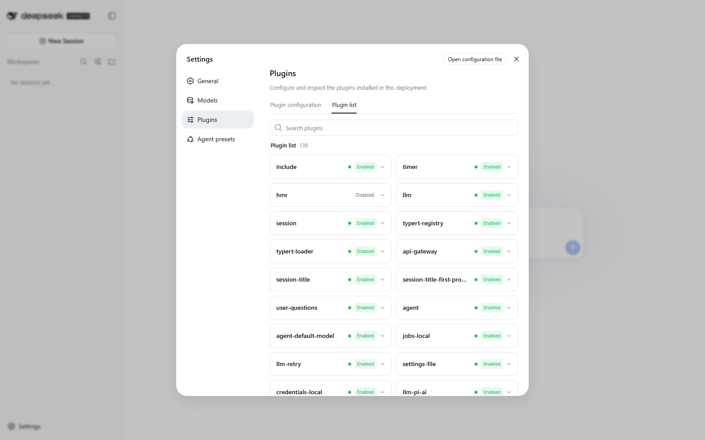

# DeepSeek Harness Mac Control

> **Give the official DeepSeek DSH runtime real, approval-gated hands on your Mac.** Inspect browser tabs, open pages, switch apps, read accessible controls, type, click, press keys, and capture the screen through one small native plugin.

[中文完整教程](TUTORIAL.zh-CN.md) · [Complete English tutorial](TUTORIAL.md) · [Official DeepSeek Harness](https://github.com/deepseek-ai/deepseek-harness) · [MIT License](LICENSE)

<p>
  <strong>Language / 语言 / 言語 / 언어:</strong>
  <a href="#简体中文">简体中文</a> ·
  <a href="#english">English</a> ·
  <a href="#日本語">日本語</a> ·
  <a href="#한국어">한국어</a> ·
  <a href="#español">Español</a> ·
  <a href="#français">Français</a> ·
  <a href="#deutsch">Deutsch</a> ·
  <a href="#português">Português</a> ·
  <a href="#русский">Русский</a> ·
  <a href="#العربية">العربية</a> ·
  <a href="#हिन्दी">हिन्दी</a> ·
  <a href="#繁體中文">繁體中文</a>
</p>

## Host UI / 宿主界面

Official DSH Web runtime in an empty, isolated local session / 官方 DSH Web
runtime 的隔离空白会话：


The same `web` profile inside the independent native macOS shell / 同一个
`web` profile 显示在独立原生 macOS 外壳中：


These lossless PNGs show the two supported host paths, not a fabricated plugin
result. Tool registration is verified with `--dump-config` and `npm test`.
[Image provenance and privacy record](docs/images/README.md).

<details open>
<summary id="简体中文"><strong>简体中文</strong></summary>

把 DeepSeek AI 官方 DSH runtime 变成能操作 Mac 的本地助手：`mac_browser` 读取和控制 Safari/Google Chrome 标签页，`mac_desktop` 读取并操作 App、窗口、辅助功能控件和屏幕截图。

**原理：** 插件不启动 HTTP 服务、不代理浏览器流量，也不保存凭据。它将经过校验的请求传给 macOS 原生 `osascript`（JXA/System Events）、`open` 和 `screencapture`。仅允许 `http`/`https` URL，文本、坐标和目标会被校验；会改变浏览器或桌面的操作默认要求确认。

**两条配置路径：**

1. **官方 DSH 路径：** 官方上游是 [deepseek-ai/deepseek-harness](https://github.com/deepseek-ai/deepseek-harness)，官方 CLI 包是 `@deepseek-ai/dsh`。本项目已用 `0.1.0-rc.6` 和 `0.1.0-rc.7` 验证，下面固定使用 `0.1.0-rc.7`。
2. **本地 macOS App 路径：** [deepseek-harness-macos-app](https://github.com/18126295767-cell/deepseek-harness-macos-app) 是独立社区 AppKit/WebKit 外壳，不是 DeepSeek AI 官方独立桌面产品。它启动同一个官方 `dsh web` 和 `~/.dsh/profiles/web`，所以插件只安装一次。

**官方 DSH 快速安装：** 要求 macOS、Node.js 20+、Git 和 pnpm。把 `<reviewed-commit-sha>` 替换为你审阅过的完整 GitHub 提交哈希；本项目尚未发布到 npm，不能使用 `plugin add dsh-mac-control` 作为安装命令。

```sh
mkdir -p "$HOME/dsh-runtime"
cd "$HOME/dsh-runtime"
npm init -y
npm install @deepseek-ai/dsh@0.1.0-rc.7
corepack enable
node node_modules/@deepseek-ai/dsh/lib/bin.js plugin --profile web add --workspace-root \
  "https://github.com/18126295767-cell/dsh-mac-control/archive/<reviewed-commit-sha>.tar.gz"
node node_modules/@deepseek-ai/dsh/lib/bin.js --profile web --dump-config
node node_modules/@deepseek-ai/dsh/lib/bin.js web --port 3080
```

打开 `http://127.0.0.1:3080`，先验证只读调用：`mac_browser: action=list_tabs, browser=Safari` 和 `mac_desktop: action=frontmost_app`。首次使用时，在「系统设置 → 隐私与安全性」中给实际启动 DSH 的 Terminal、Node 或 App 授予自动化、辅助功能和屏幕录制权限。

**本机 App 外壳配置：** 当前机器使用 `$HOME/Documents/学习/dsh-runtime`、`$HOME/Documents/学习/deepseek-harness-macos-app`、`/Applications/DeepSeek Harness.app` 和 `$HOME/Library/LaunchAgents/com.houxinran.deepseek-harness.plist`。先按官方路径把插件安装进 `web` profile，再从 App 项目运行 `zsh ./scripts/build-app.sh`，最后执行 `plutil -p "$HOME/Library/LaunchAgents/com.houxinran.deepseek-harness.plist"` 核对 runtime 路径。

`$HOME/Documents/学习/deepseek-harness-ultimate` 是社区维护的可选扩展 profile，不是官方发行、不是 App 源码，也不会自动配置 App。完整命令、源码测试、日志、权限撤销和故障排除见[中文教程](TUTORIAL.zh-CN.md)。绝不要在工具参数、提交、截图或 issue 中放入密码、API Key、Cookie 或恢复码。

</details>

<details open>
<summary id="english"><strong>English</strong></summary>

Turn the official DeepSeek AI DSH runtime into a practical local Mac operator. `mac_browser` inspects and controls Safari or Google Chrome tabs; `mac_desktop` reads and operates apps, windows, accessibility controls, and screenshots.

**How it works:** The plugin starts no HTTP server, proxies no browser traffic, and stores no credentials. It passes validated requests to native macOS `osascript` (JXA/System Events), `open`, and `screencapture`. URLs are limited to `http`/`https`; text, coordinates, and targets are validated; browser or desktop mutations require approval by default.

**Two setup paths:**

1. **Official DSH:** The official upstream is [deepseek-ai/deepseek-harness](https://github.com/deepseek-ai/deepseek-harness), and the official CLI package is `@deepseek-ai/dsh`. This project was tested with `0.1.0-rc.6` and `0.1.0-rc.7`; the commands pin `0.1.0-rc.7`.
2. **Local macOS App:** [deepseek-harness-macos-app](https://github.com/18126295767-cell/deepseek-harness-macos-app) is an independent community AppKit/WebKit shell, not an official standalone DeepSeek AI desktop product. It starts the same official `dsh web` and reads `~/.dsh/profiles/web`, so install the plugin once.

**Official DSH quick start:** Requires macOS, Node.js 20+, Git, and pnpm. Replace `<reviewed-commit-sha>` with a full GitHub commit hash you reviewed. This project is not published to npm, so `plugin add dsh-mac-control` is not a valid install command.

```sh
mkdir -p "$HOME/dsh-runtime"
cd "$HOME/dsh-runtime"
npm init -y
npm install @deepseek-ai/dsh@0.1.0-rc.7
corepack enable
node node_modules/@deepseek-ai/dsh/lib/bin.js plugin --profile web add --workspace-root \
  "https://github.com/18126295767-cell/dsh-mac-control/archive/<reviewed-commit-sha>.tar.gz"
node node_modules/@deepseek-ai/dsh/lib/bin.js --profile web --dump-config
node node_modules/@deepseek-ai/dsh/lib/bin.js web --port 3080
```

Open `http://127.0.0.1:3080`, then smoke-test read-only calls: `mac_browser: action=list_tabs, browser=Safari` and `mac_desktop: action=frontmost_app`. On first use, grant Automation, Accessibility, and Screen Recording to the Terminal, Node process, or App that actually starts DSH.

**This Mac's App shell:** The current machine uses `$HOME/Documents/学习/dsh-runtime`, `$HOME/Documents/学习/deepseek-harness-macos-app`, `/Applications/DeepSeek Harness.app`, and `$HOME/Library/LaunchAgents/com.houxinran.deepseek-harness.plist`. Install the plugin into `web` first, run `zsh ./scripts/build-app.sh` from the App project, and verify the generated runtime path with `plutil -p "$HOME/Library/LaunchAgents/com.houxinran.deepseek-harness.plist"`.

`$HOME/Documents/学习/deepseek-harness-ultimate` is an optional community-maintained profile. It is not an official release, not the App source, and does not configure the App automatically. See the [complete tutorial](TUTORIAL.md) for source tests, build commands, logs, permission removal, and troubleshooting. Never put passwords, API keys, cookies, or recovery codes in tool arguments, commits, screenshots, or issues.

</details>

<details>
<summary id="日本語"><strong>日本語</strong></summary>

DeepSeek AI 公式の DSH runtime に、Mac のブラウザとデスクトップを操作する `mac_browser` と `mac_desktop` を追加します。HTTP サーバーやプロキシを起動せず、認証情報も保存しません。検証済みの要求だけを macOS の `osascript`、`open`、`screencapture` に渡し、変更操作は既定で承認を求めます。

構成は二つです。公式構成では [deepseek-ai/deepseek-harness](https://github.com/deepseek-ai/deepseek-harness) の `@deepseek-ai/dsh@0.1.0-rc.7` を使用し、確認したコミットのアーカイブを `plugin --profile web add --workspace-root` で追加します。[deepseek-harness-macos-app](https://github.com/18126295767-cell/deepseek-harness-macos-app) は同じ `dsh web` と `~/.dsh/profiles/web` を表示する非公式コミュニティ製 AppKit/WebKit シェルで、プラグインを二重にインストールする必要はありません。

必要環境は macOS、Node.js 20+、Git、pnpm です。`--dump-config` で `mac-control` を確認後、`mac_browser: action=list_tabs, browser=Safari` と `mac_desktop: action=frontmost_app` を実行してください。Automation、Accessibility、Screen Recording を実際の起動プロセスに許可します。`deepseek-harness-ultimate` は別の任意コミュニティ profile であり、公式版でも App ソースでもありません。正確なコマンドは [English tutorial](TUTORIAL.md) を参照してください。

</details>

<details>
<summary id="한국어"><strong>한국어</strong></summary>

DeepSeek AI 공식 DSH runtime에 Mac 브라우저와 데스크톱을 제어하는 `mac_browser`, `mac_desktop`을 추가합니다. HTTP 서버나 프록시를 실행하지 않고 자격 증명을 저장하지 않으며, 검증된 요청만 macOS `osascript`, `open`, `screencapture`로 전달합니다. 변경 작업은 기본적으로 승인을 요청합니다.

설정은 두 경로입니다. 공식 경로는 [deepseek-ai/deepseek-harness](https://github.com/deepseek-ai/deepseek-harness)의 `@deepseek-ai/dsh@0.1.0-rc.7`에 검토한 커밋 아카이브를 `plugin --profile web add --workspace-root`로 설치합니다. [deepseek-harness-macos-app](https://github.com/18126295767-cell/deepseek-harness-macos-app)은 같은 `dsh web`과 `~/.dsh/profiles/web`을 표시하는 비공식 커뮤니티 AppKit/WebKit 셸이므로 플러그인을 다시 설치하지 않습니다.

macOS, Node.js 20+, Git, pnpm이 필요합니다. `--dump-config`에서 `mac-control`을 확인한 뒤 `mac_browser: action=list_tabs, browser=Safari`와 `mac_desktop: action=frontmost_app`으로 검사하세요. 실제 시작 프로세스에 Automation, Accessibility, Screen Recording 권한을 부여해야 합니다. `deepseek-harness-ultimate`는 별도의 선택형 커뮤니티 profile이며 공식 배포판이나 App 소스가 아닙니다. 정확한 명령은 [English tutorial](TUTORIAL.md)에 있습니다.

</details>

<details>
<summary id="español"><strong>Español</strong></summary>

Añade `mac_browser` y `mac_desktop` al runtime DSH oficial de DeepSeek AI para controlar el navegador y el escritorio del Mac. No inicia un servidor HTTP, no usa proxy y no guarda credenciales; solo entrega solicitudes validadas a `osascript`, `open` y `screencapture` de macOS. Las acciones que modifican el sistema requieren aprobación de forma predeterminada.

Hay dos rutas. La oficial instala un archivo de commit revisado mediante `plugin --profile web add --workspace-root` sobre `@deepseek-ai/dsh@0.1.0-rc.7` de [deepseek-ai/deepseek-harness](https://github.com/deepseek-ai/deepseek-harness). [deepseek-harness-macos-app](https://github.com/18126295767-cell/deepseek-harness-macos-app) es una envoltura comunitaria AppKit/WebKit, no un producto de escritorio oficial; muestra el mismo `dsh web` y `~/.dsh/profiles/web`, por lo que el plugin se instala una sola vez.

Requiere macOS, Node.js 20+, Git y pnpm. Comprueba `mac-control` con `--dump-config` y prueba `mac_browser: action=list_tabs, browser=Safari` y `mac_desktop: action=frontmost_app`. Concede Automation, Accessibility y Screen Recording al proceso que inicia DSH. `deepseek-harness-ultimate` es un profile comunitario opcional independiente, no una versión oficial ni el código de la App. Consulta [English tutorial](TUTORIAL.md) para los comandos exactos.

</details>

<details>
<summary id="français"><strong>Français</strong></summary>

Ajoutez `mac_browser` et `mac_desktop` au runtime DSH officiel de DeepSeek AI pour piloter le navigateur et le bureau du Mac. Le plugin ne lance aucun serveur HTTP, ne fait pas proxy et ne stocke aucun identifiant ; il transmet uniquement des requêtes validées à `osascript`, `open` et `screencapture` de macOS. Les mutations demandent une approbation par défaut.

Deux parcours sont documentés. Le parcours officiel installe une archive de commit relue avec `plugin --profile web add --workspace-root` sur `@deepseek-ai/dsh@0.1.0-rc.7` de [deepseek-ai/deepseek-harness](https://github.com/deepseek-ai/deepseek-harness). [deepseek-harness-macos-app](https://github.com/18126295767-cell/deepseek-harness-macos-app) est une enveloppe AppKit/WebKit communautaire non officielle ; elle affiche le même `dsh web` et `~/.dsh/profiles/web`, donc le plugin ne s'installe qu'une fois.

Il faut macOS, Node.js 20+, Git et pnpm. Vérifiez `mac-control` avec `--dump-config`, puis testez `mac_browser: action=list_tabs, browser=Safari` et `mac_desktop: action=frontmost_app`. Accordez Automation, Accessibility et Screen Recording au processus qui démarre réellement DSH. `deepseek-harness-ultimate` est un profile communautaire optionnel distinct, ni une version officielle ni le code de l'App. Voir [English tutorial](TUTORIAL.md) pour les commandes exactes.

</details>

<details>
<summary id="deutsch"><strong>Deutsch</strong></summary>

Erweitere die offizielle DeepSeek-AI-DSH-Runtime mit `mac_browser` und `mac_desktop` zur Steuerung von Browser und Mac-Schreibtisch. Das Plugin startet keinen HTTP-Server oder Proxy und speichert keine Zugangsdaten. Es übergibt nur geprüfte Anfragen an macOS `osascript`, `open` und `screencapture`; Änderungen benötigen standardmäßig eine Bestätigung.

Es gibt zwei Wege. Der offizielle Weg installiert ein geprüftes Commit-Archiv per `plugin --profile web add --workspace-root` in `@deepseek-ai/dsh@0.1.0-rc.7` aus [deepseek-ai/deepseek-harness](https://github.com/deepseek-ai/deepseek-harness). [deepseek-harness-macos-app](https://github.com/18126295767-cell/deepseek-harness-macos-app) ist eine unabhängige, nicht offizielle AppKit/WebKit-Hülle. Sie zeigt dasselbe `dsh web` und `~/.dsh/profiles/web`; das Plugin wird daher nur einmal installiert.

Benötigt werden macOS, Node.js 20+, Git und pnpm. Prüfe `mac-control` mit `--dump-config` und teste `mac_browser: action=list_tabs, browser=Safari` sowie `mac_desktop: action=frontmost_app`. Automation, Accessibility und Screen Recording müssen dem tatsächlich startenden Prozess erlaubt werden. `deepseek-harness-ultimate` ist ein separates optionales Community-profile, keine offizielle Ausgabe und kein App-Quellcode. Exakte Befehle stehen im [English tutorial](TUTORIAL.md).

</details>

<details>
<summary id="português"><strong>Português</strong></summary>

Adicione `mac_browser` e `mac_desktop` ao runtime DSH oficial da DeepSeek AI para controlar o navegador e a área de trabalho do Mac. O plugin não inicia servidor HTTP, não atua como proxy e não armazena credenciais; apenas encaminha solicitações validadas para `osascript`, `open` e `screencapture` do macOS. Alterações exigem aprovação por padrão.

Há dois caminhos. O oficial instala um arquivo de commit revisado via `plugin --profile web add --workspace-root` sobre `@deepseek-ai/dsh@0.1.0-rc.7` do [deepseek-ai/deepseek-harness](https://github.com/deepseek-ai/deepseek-harness). [deepseek-harness-macos-app](https://github.com/18126295767-cell/deepseek-harness-macos-app) é uma interface AppKit/WebKit comunitária e não oficial; ela exibe o mesmo `dsh web` e `~/.dsh/profiles/web`, portanto o plugin é instalado uma única vez.

Requer macOS, Node.js 20+, Git e pnpm. Confirme `mac-control` com `--dump-config` e teste `mac_browser: action=list_tabs, browser=Safari` e `mac_desktop: action=frontmost_app`. Conceda Automation, Accessibility e Screen Recording ao processo que realmente inicia o DSH. `deepseek-harness-ultimate` é um profile comunitário opcional separado, não uma versão oficial nem o código da App. Veja [English tutorial](TUTORIAL.md) para os comandos exatos.

</details>

<details>
<summary id="русский"><strong>Русский</strong></summary>

Добавьте `mac_browser` и `mac_desktop` в официальный DSH runtime от DeepSeek AI для управления браузером и рабочим столом Mac. Плагин не запускает HTTP-сервер или прокси и не хранит учетные данные. Он передает только проверенные запросы в macOS `osascript`, `open` и `screencapture`; изменяющие действия по умолчанию требуют подтверждения.

Описаны два пути. Официальный путь устанавливает проверенный архив коммита через `plugin --profile web add --workspace-root` в `@deepseek-ai/dsh@0.1.0-rc.7` из [deepseek-ai/deepseek-harness](https://github.com/deepseek-ai/deepseek-harness). [deepseek-harness-macos-app](https://github.com/18126295767-cell/deepseek-harness-macos-app) — независимая неофициальная оболочка AppKit/WebKit. Она показывает тот же `dsh web` и `~/.dsh/profiles/web`, поэтому плагин устанавливается один раз.

Нужны macOS, Node.js 20+, Git и pnpm. Проверьте `mac-control` через `--dump-config`, затем вызовите `mac_browser: action=list_tabs, browser=Safari` и `mac_desktop: action=frontmost_app`. Выдайте Automation, Accessibility и Screen Recording процессу, который запускает DSH. `deepseek-harness-ultimate` — отдельный необязательный community-profile, не официальный выпуск и не исходный код App. Точные команды приведены в [English tutorial](TUTORIAL.md).

</details>

<details>
<summary id="العربية"><strong>العربية</strong></summary>

<div dir="rtl">

أضف `mac_browser` و`mac_desktop` إلى runtime الرسمي لـ DSH من DeepSeek AI للتحكم في متصفح Mac وسطح المكتب. لا تشغّل الإضافة خادم HTTP أو proxy ولا تحفظ بيانات الاعتماد؛ بل تمرر الطلبات المتحقق منها فقط إلى `osascript` و`open` و`screencapture` في macOS. تتطلب إجراءات التغيير موافقة افتراضيًا.

هناك مساران. يثبت المسار الرسمي أرشيف commit تمت مراجعته بواسطة `plugin --profile web add --workspace-root` فوق `@deepseek-ai/dsh@0.1.0-rc.7` من [deepseek-ai/deepseek-harness](https://github.com/deepseek-ai/deepseek-harness). أما [deepseek-harness-macos-app](https://github.com/18126295767-cell/deepseek-harness-macos-app) فهي واجهة AppKit/WebKit مجتمعية مستقلة وغير رسمية، تعرض نفس `dsh web` و`~/.dsh/profiles/web`، لذلك تثبت الإضافة مرة واحدة.

المتطلبات هي macOS وNode.js 20+ وGit وpnpm. تحقق من `mac-control` عبر `--dump-config` ثم اختبر `mac_browser: action=list_tabs, browser=Safari` و`mac_desktop: action=frontmost_app`. امنح Automation وAccessibility وScreen Recording للعملية التي تشغّل DSH فعليًا. `deepseek-harness-ultimate` هو profile مجتمعي اختياري منفصل، وليس إصدارًا رسميًا أو مصدر App. راجع [English tutorial](TUTORIAL.md) للأوامر الدقيقة.

</div>

</details>

<details>
<summary id="हिन्दी"><strong>हिन्दी</strong></summary>

Mac browser और desktop को नियंत्रित करने के लिए DeepSeek AI के official DSH runtime में `mac_browser` और `mac_desktop` जोड़ें। Plugin HTTP server या proxy नहीं चलाता और credentials store नहीं करता; यह केवल validated requests को macOS `osascript`, `open` और `screencapture` तक भेजता है। बदलाव करने वाली actions default रूप से approval मांगती हैं।

दो setup paths हैं। Official path [deepseek-ai/deepseek-harness](https://github.com/deepseek-ai/deepseek-harness) के `@deepseek-ai/dsh@0.1.0-rc.7` में reviewed commit archive को `plugin --profile web add --workspace-root` से install करता है। [deepseek-harness-macos-app](https://github.com/18126295767-cell/deepseek-harness-macos-app) स्वतंत्र, unofficial community AppKit/WebKit shell है; यह वही `dsh web` और `~/.dsh/profiles/web` दिखाता है, इसलिए plugin एक बार install होता है।

macOS, Node.js 20+, Git और pnpm आवश्यक हैं। `--dump-config` में `mac-control` जांचें, फिर `mac_browser: action=list_tabs, browser=Safari` और `mac_desktop: action=frontmost_app` चलाएँ। DSH शुरू करने वाली वास्तविक process को Automation, Accessibility और Screen Recording permissions दें। `deepseek-harness-ultimate` अलग optional community profile है, official release या App source नहीं। सटीक commands के लिए [English tutorial](TUTORIAL.md) देखें।

</details>

<details>
<summary id="繁體中文"><strong>繁體中文</strong></summary>

把 DeepSeek AI 官方 DSH runtime 變成能操作 Mac 的本機助手：`mac_browser` 讀取及控制 Safari/Google Chrome 分頁，`mac_desktop` 讀取並操作 App、視窗、輔助功能控制項與螢幕截圖。

外掛不啟動 HTTP 服務、不代理瀏覽器流量，也不儲存憑據；它只把已驗證要求交給 macOS `osascript`、`open` 與 `screencapture`，變更操作預設需要確認。官方路徑使用 [deepseek-ai/deepseek-harness](https://github.com/deepseek-ai/deepseek-harness) 的 `@deepseek-ai/dsh@0.1.0-rc.7`，以 `plugin --profile web add --workspace-root` 安裝審閱過的 commit archive。

[deepseek-harness-macos-app](https://github.com/18126295767-cell/deepseek-harness-macos-app) 是獨立且非官方的社群 AppKit/WebKit 外殼，顯示同一個 `dsh web` 與 `~/.dsh/profiles/web`，所以外掛只需安裝一次。需要 macOS、Node.js 20+、Git 與 pnpm；先用 `--dump-config` 確認 `mac-control`，再測試 `mac_browser: action=list_tabs, browser=Safari` 及 `mac_desktop: action=frontmost_app`，並把 Automation、Accessibility、Screen Recording 權限授予實際啟動程序。`deepseek-harness-ultimate` 是獨立的可選社群 profile，不是官方發行或 App 原始碼。完整步驟見[中文教程](TUTORIAL.zh-CN.md)。

</details>

## Windows Companion / Windows 配套包

Windows can run the official DSH Web runtime, but this package's `mac_browser`
and `mac_desktop` tools are macOS-only. The Windows launcher, environment
bootstrap, portable ZIP, NSIS installer, and SHA-256 manifest live in the
[companion package](https://github.com/18126295767-cell/deepseek-harness-macos-app/tree/codex/windows-release-candidate/windows).
It does not pretend to provide macOS Automation or Accessibility controls on
Windows. The full setup is in [TUTORIAL.md](TUTORIAL.md) and
[TUTORIAL.zh-CN.md](TUTORIAL.zh-CN.md).

The official Web runtime was verified on a real `windows-2025` runner with a
fresh, empty browser profile / 官方 Web runtime 已在真实 `windows-2025` Runner
的全新空白浏览器 profile 中验证：


The official settings UI exposes the host plugin inventory; this image does
not claim that the macOS-only `dsh-mac-control` plugin runs on Windows / 官方
设置界面会显示宿主插件清单；此图不表示仅适用于 macOS 的 `dsh-mac-control` 能在
Windows 运行：



The [image record](docs/images/README.md) includes runner provenance, hashes,
OCR privacy scanning, and visual review / [图片记录](docs/images/README.md)包含
Runner 来源、哈希、OCR 隐私扫描和逐张目检结果。

| Language | Windows boundary and package link |
| --- | --- |
| 日本語 | Windows は公式 DSH Web runtime を実行できますが、`mac_browser` と `mac_desktop` は macOS 専用です。[Windows companion](https://github.com/18126295767-cell/deepseek-harness-macos-app/tree/codex/windows-release-candidate/windows) に bootstrap、portable ZIP、NSIS、SHA-256 があります。 |
| 한국어 | Windows에서는 공식 DSH Web runtime만 실행할 수 있고 `mac_browser`와 `mac_desktop`은 macOS 전용입니다. [Windows companion](https://github.com/18126295767-cell/deepseek-harness-macos-app/tree/codex/windows-release-candidate/windows)에 bootstrap, portable ZIP, NSIS, SHA-256이 있습니다. |
| Español | Windows puede ejecutar el runtime Web oficial, pero `mac_browser` y `mac_desktop` son exclusivos de macOS. El [paquete Windows](https://github.com/18126295767-cell/deepseek-harness-macos-app/tree/codex/windows-release-candidate/windows) incluye bootstrap, ZIP portable, NSIS y SHA-256. |
| Français | Windows peut lancer le runtime Web officiel, mais `mac_browser` et `mac_desktop` restent réservés à macOS. Le [package Windows](https://github.com/18126295767-cell/deepseek-harness-macos-app/tree/codex/windows-release-candidate/windows) fournit bootstrap, ZIP portable, NSIS et SHA-256. |
| Deutsch | Windows kann die offizielle DSH-Web-Runtime starten, aber `mac_browser` und `mac_desktop` sind macOS-only. Das [Windows-Paket](https://github.com/18126295767-cell/deepseek-harness-macos-app/tree/codex/windows-release-candidate/windows) enthält Bootstrap, portable ZIP, NSIS und SHA-256. |
| Português | O Windows pode executar o runtime Web oficial, mas `mac_browser` e `mac_desktop` são exclusivos do macOS. O [pacote Windows](https://github.com/18126295767-cell/deepseek-harness-macos-app/tree/codex/windows-release-candidate/windows) fornece bootstrap, ZIP portátil, NSIS e SHA-256. |
| Русский | Windows запускает официальный DSH Web runtime, но `mac_browser` и `mac_desktop` предназначены только для macOS. [Пакет Windows](https://github.com/18126295767-cell/deepseek-harness-macos-app/tree/codex/windows-release-candidate/windows) содержит bootstrap, portable ZIP, NSIS и SHA-256. |
| العربية | يمكن لـ Windows تشغيل runtime الويب الرسمي، لكن `mac_browser` و`mac_desktop` مخصصان لـ macOS فقط. يوفّر [Windows companion](https://github.com/18126295767-cell/deepseek-harness-macos-app/tree/codex/windows-release-candidate/windows) bootstrap وZIP محمولًا وNSIS وSHA-256. |
| हिन्दी | Windows official DSH Web runtime चला सकता है, लेकिन `mac_browser` और `mac_desktop` केवल macOS के लिए हैं। [Windows companion](https://github.com/18126295767-cell/deepseek-harness-macos-app/tree/codex/windows-release-candidate/windows) में bootstrap, portable ZIP, NSIS और SHA-256 है। |
| 繁體中文 | Windows 可執行官方 DSH Web runtime，但 `mac_browser` 與 `mac_desktop` 僅支援 macOS。[Windows 配套包](https://github.com/18126295767-cell/deepseek-harness-macos-app/tree/codex/windows-release-candidate/windows) 提供環境引導、portable ZIP、NSIS 與 SHA-256。 |

## License

Released under the [MIT License](LICENSE).
