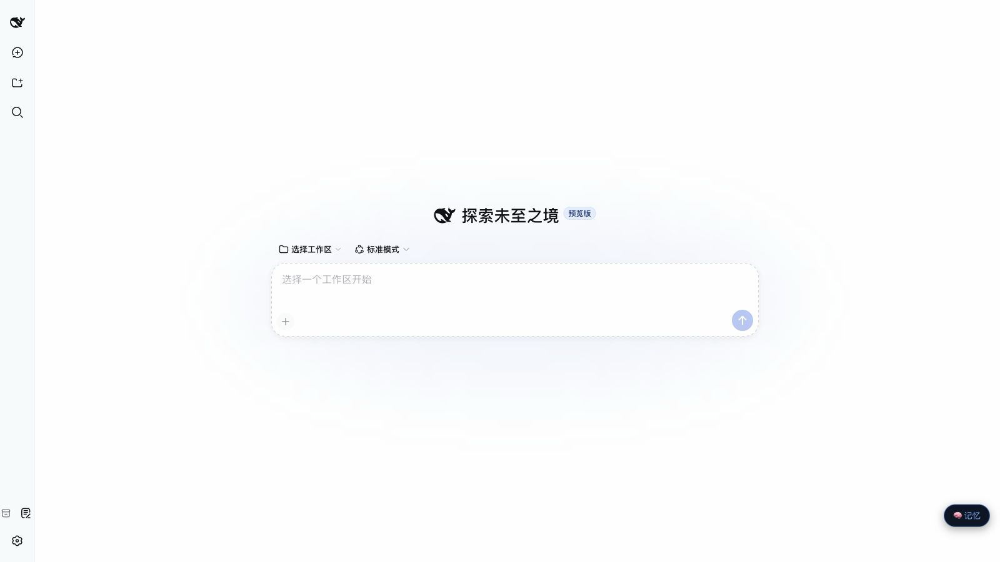

# DeepSeek Harness Mac Control Tutorial

This tutorial covers two verified paths:

1. **Official DeepSeek DSH runtime:** the DeepSeek AI `@deepseek-ai/dsh` CLI and Web profile.
2. **Local macOS desktop shell:** a native AppKit/WebKit window that displays the same official DSH Web profile.

The desktop shell is not a second plugin system or an official standalone DeepSeek AI desktop product. It starts or connects to local `dsh web` and reads the same `~/.dsh/profiles/web` profile, so install the plugin once.

`deepseek-harness-ultimate` is an independent community-maintained optional profile. It is not an official DeepSeek AI release and it does not replace the `web` profile in this tutorial.

## 0. Prerequisites

- macOS. The plugin controls Safari, Google Chrome, `osascript`, Accessibility, and screenshot APIs.
- Node.js 20 or newer. `deepseek-harness-ultimate` itself requires Node.js 22 or newer.
- Git and pnpm. Run `corepack enable` to enable the pnpm shipped with Node.

```sh
node --version
corepack enable
pnpm --version
```

This tutorial never creates, copies, or commits API keys, passwords, cookies, recovery codes, or browser sessions.

## 1. Path A: Official DeepSeek DSH Runtime

The official upstream is [deepseek-ai/deepseek-harness](https://github.com/deepseek-ai/deepseek-harness); the official CLI package is `@deepseek-ai/dsh`. This guide was integration-tested with `@deepseek-ai/dsh@0.1.0-rc.6` and `@deepseek-ai/dsh@0.1.0-rc.7`. The commands below use `0.1.0-rc.7` so the runtime version is explicit.

Create a dedicated runtime directory when you do not already have one:

```sh
mkdir -p "$HOME/dsh-runtime"
cd "$HOME/dsh-runtime"
npm init -y
npm install @deepseek-ai/dsh@0.1.0-rc.7
```

Install this plugin into the official Web profile:

```sh
node node_modules/@deepseek-ai/dsh/lib/bin.js plugin --profile web add \
  "https://github.com/18126295767-cell/dsh-mac-control/archive/<reviewed-commit-sha>.tar.gz"
```

Replace `<reviewed-commit-sha>` with the full commit hash shown on the GitHub commit you reviewed. This repository is not published to npm, so `plugin add dsh-mac-control` is not a valid reproducible install command.

Verify bundle recognition without starting a service:

```sh
node node_modules/@deepseek-ai/dsh/lib/bin.js --profile web --dump-config
```

The output must include:

```yaml
# == dsh-mac-control
- id: mac-control
  name: dsh-mac-control
```

Start the official Web runtime:

```sh
node node_modules/@deepseek-ai/dsh/lib/bin.js web --port 3080
```

Open `http://127.0.0.1:3080`. Configure the model provider in the runtime's own settings or environment, never in this repository.

The clean official Web host should look like this before adding a workspace,
account, or credential:



### First verification and permissions

Ask Harness to call the read-only tools first:

```text
mac_browser: action=list_tabs, browser=Safari
mac_desktop: action=frontmost_app
```

For a screenshot, use `mac_desktop` with `screenshot`. When macOS prompts, grant Automation, Accessibility, and Screen Recording to the process that actually launches DSH: usually Terminal, iTerm, Node, or the desktop shell's Node process.

The default configuration requests approval for browser or desktop mutations. The user should always enter passwords, API keys, cookies, recovery codes, and other secrets personally.

## 2. Path B: Local DeepSeek Harness macOS Desktop Shell

The app source is the independent community project [deepseek-harness-macos-app](https://github.com/18126295767-cell/deepseek-harness-macos-app). It is a native wrapper: its LaunchAgent starts a command like this, then its window displays local `127.0.0.1:3080`:

```sh
node /absolute/path/to/dsh-runtime/node_modules/@deepseek-ai/dsh/lib/bin.js web --port 3080
```

Install the plugin into the `web` profile through Path A first. Then build and install the shell from its standard source tree:

```sh
cd /absolute/path/to/deepseek-harness-macos-app
zsh ./scripts/build-app.sh --dsh-runtime /absolute/path/to/dsh-runtime --install
open "$HOME/Applications/DeepSeek Harness.app"
```

Path B displays the same local `web` profile in a native macOS window:


For an already installed app, inspect its actual runtime rather than guessing:

```sh
plutil -p "$HOME/Library/LaunchAgents/com.houxinran.deepseek-harness.plist"
```

The second item in `ProgramArguments` must point to the official `@deepseek-ai/dsh/lib/bin.js` you intend to use. After changing runtime locations, re-run the same build script with `--dsh-runtime ... --install`. Logs are stored at:

```text
~/Library/Logs/DeepSeekHarness.log
```

Run the same read-only checks inside the app. The app does not hold a separate plugin copy; it renders the official Web profile started by its LaunchAgent.

### This Mac's current layout

The current machine uses these paths. They are documented as a local reference, not as portable public defaults:

```text
Official DSH runtime: $HOME/Documents/学习/dsh-runtime
App shell source:     $HOME/Documents/学习/deepseek-harness-macos-app
Installed app:        /Applications/DeepSeek Harness.app
LaunchAgent:          $HOME/Library/LaunchAgents/com.houxinran.deepseek-harness.plist
Log:                  $HOME/Library/Logs/DeepSeekHarness.log
```

Its LaunchAgent currently starts:

```sh
/usr/local/bin/node \
  "$HOME/Documents/学习/dsh-runtime/node_modules/@deepseek-ai/dsh/lib/bin.js" \
  web --port 3080
```

The installed bundle identifier is `com.houxinran.deepseek-harness`. Because this existing copy is under `/Applications`, launch it with a location-independent command:

```sh
open -a "DeepSeek Harness"
```

The installed App currently labels its shell as `0.1.0-rc.6`, and the configured runtime currently contains `@deepseek-ai/dsh@0.1.0-rc.6`. The App label and CLI package version are separate values. Check the runtime version directly instead of inferring it from the App's About/Info data:

```sh
cd "$HOME/Documents/学习/dsh-runtime"
node -p "require('./node_modules/@deepseek-ai/dsh/package.json').version"
```

If the runtime is moved or upgraded, rebuild from the App source directory and reinstall, then re-run `plutil -p` to verify the generated LaunchAgent before opening the App.

## 3. Optional: Community Extension Profile

[deepseek-harness-ultimate](https://github.com/18126295767-cell/deepseek-harness-ultimate) is a community-maintained, commit-pinned collection of extra plugins. On this Mac its source is `$HOME/Documents/学习/deepseek-harness-ultimate`. Try it in a separate profile rather than replacing the stable `web` profile:

```sh
cd /absolute/path/to/deepseek-harness-ultimate
node scripts/audit-manifest.mjs
node scripts/install-ultimate.mjs --profile-dir "$HOME/.dsh/profiles/ultimate"
```

This does **not** configure the desktop App: the App's LaunchAgent explicitly runs the official `web` profile. It also does not install DSH core. Treat `ultimate` as a separate audit/install experiment unless you deliberately redesign and test a complete Web profile. The profile can include third-party components requiring permissions, credentials, or compatibility review. Review its `COMPONENTS.md` and `profile/manifest.json` before use. Do not install untrusted plugins into the daily `web` profile.

## 4. Reproduce This Plugin from Source

```sh
git clone https://github.com/18126295767-cell/dsh-mac-control.git
cd dsh-mac-control
npm ci
npm test
npm pack --dry-run --json
```

Link the checkout to a temporary profile:

```sh
node /absolute/path/to/dsh-runtime/node_modules/@deepseek-ai/dsh/lib/bin.js \
  plugin --profile mac-control-test add .
node /absolute/path/to/dsh-runtime/node_modules/@deepseek-ai/dsh/lib/bin.js \
  --profile mac-control-test --dump-config
```

Remove only the named test profile when finished:

```sh
rm -rf "$HOME/.dsh/profiles/mac-control-test"
```

Never recursively delete `~/.dsh`.

## 5. Uninstall and Revoke Permissions

Remove the plugin only from the profile where it was installed:

```sh
node /absolute/path/to/dsh-runtime/node_modules/@deepseek-ai/dsh/lib/bin.js \
  plugin --profile web remove dsh-mac-control
```

Confirm removal with `--profile web --dump-config`. Existing screenshots remain under `~/.dsh/mac-control/screenshots`; review them before deleting individual files.

To stop using the App shell, quit the App and unload its named LaunchAgent:

```sh
launchctl bootout "gui/$(id -u)/com.houxinran.deepseek-harness"
```

You can then move `DeepSeek Harness.app` and `~/Library/LaunchAgents/com.houxinran.deepseek-harness.plist` to Trash. Revoke Automation, Accessibility, and Screen Recording manually in System Settings → Privacy & Security for the App, Terminal, or Node entry you previously approved. Do not delete the shared `~/.dsh` directory just to remove this plugin or shell.

## 6. Windows Companion Environment

Windows can run the official DSH Web runtime, but this package's `mac_browser`
and `mac_desktop` tools are macOS-only: they call `osascript`, Apple
Automation, Accessibility, and Screen Recording. Do not install this package
into a Windows profile expecting those tools to work.

For a Windows desktop launcher, use the companion package in
[deepseek-harness-macos-app/windows](https://github.com/18126295767-cell/deepseek-harness-macos-app/tree/main/windows).
It starts the official Web runtime and produces a portable ZIP, an NSIS
per-user installer, and a SHA-256 manifest. On Windows 10/11 x64:

```powershell
Set-Location windows
& .\bootstrap-build-environment.ps1
& .\build-release.ps1 -Version 0.1.0
```

The bootstrap uses `winget` to install Git, Node.js LTS, and NSIS, then creates
`$HOME\dsh-runtime` with `@deepseek-ai/dsh@0.1.0-rc.7`. It does not install
credentials, profiles, or this macOS-only plugin. Reopen PowerShell after a
tool installer changes `PATH`.

The Windows launcher logs to `%LOCALAPPDATA%\DeepSeek Harness\logs` and leaves
the DSH runtime/profile untouched when uninstalled. A future Windows-native
browser/desktop-control plugin must be reviewed and installed separately; it
cannot be inferred from this macOS implementation.

## Troubleshooting

| Symptom | Check and fix |
| --- | --- |
| `pnpm not found` | Run `corepack enable`, open a new terminal, then retry. |
| DSH does not show `mac-control` | Run `--dump-config`; make sure the installed `--profile` matches the booted profile. |
| The app opens without the plugin | The app loads the LaunchAgent's `dsh web`; check its runtime path and that runtime's `~/.dsh/profiles/web/package.json`. |
| macOS denies automation or screenshots | Grant access under Privacy & Security to the terminal, Node, or app that starts the runtime, then retry. |
| A third-party profile fails | Reproduce with a clean profile and use `--dump-config` to isolate a bundle; do not blindly remove production dependencies. |
